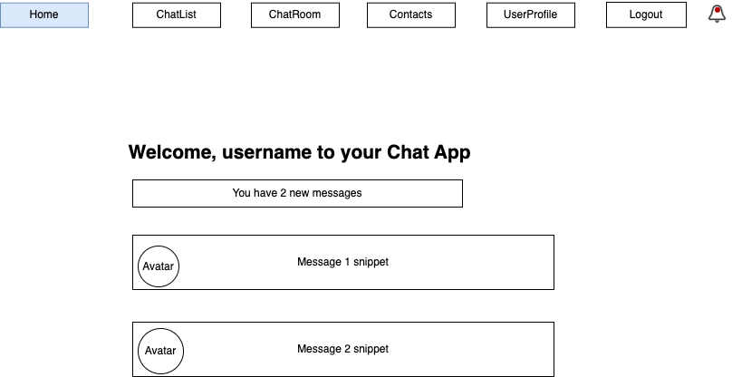
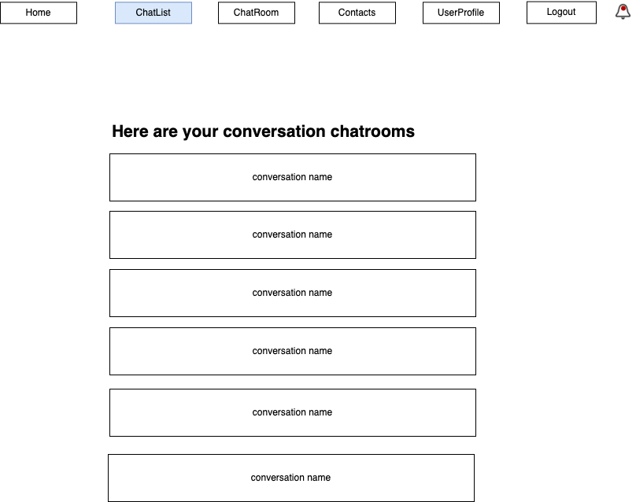
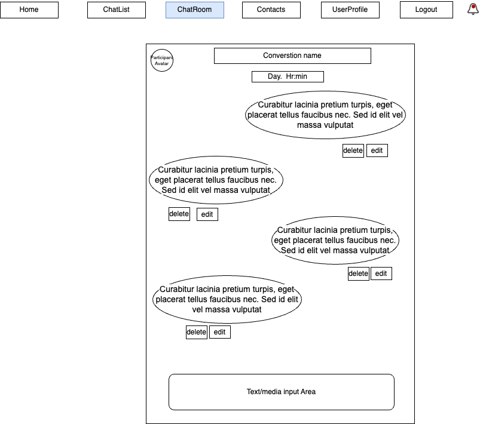
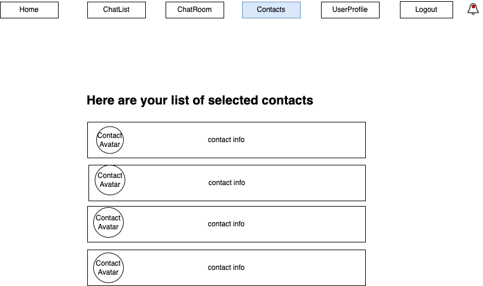
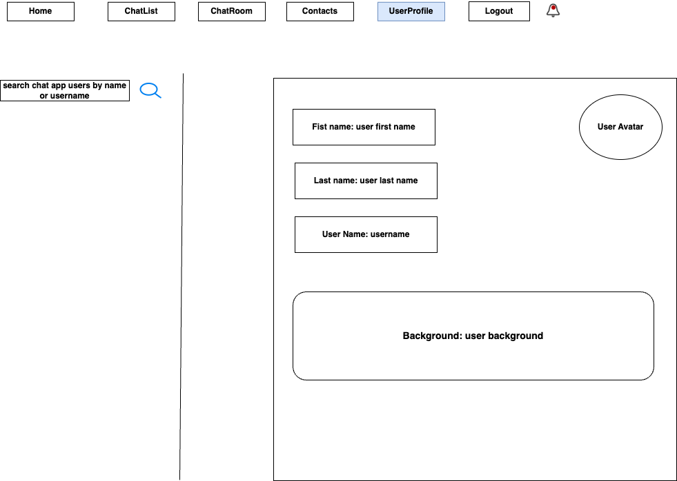
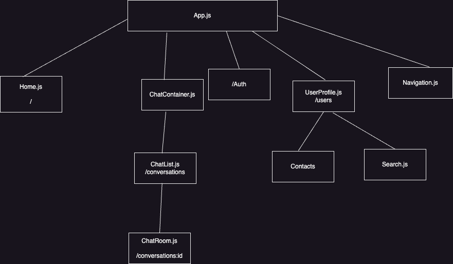
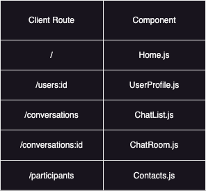
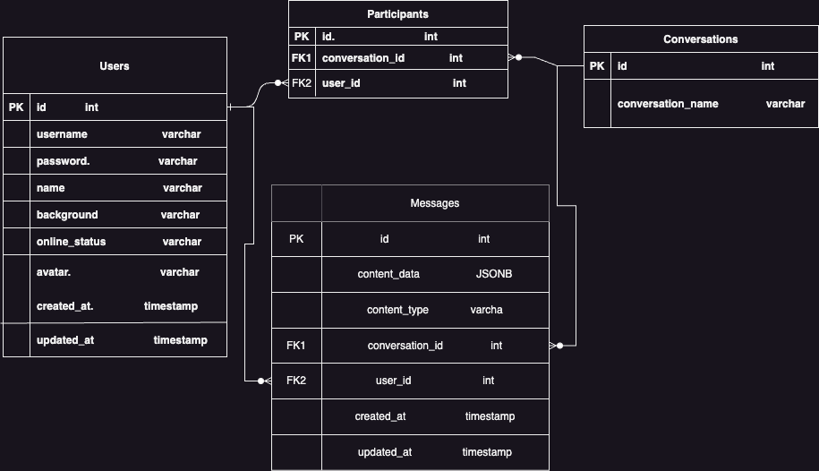

Description: 

Real-time Chat application for private or group messaging of text and/or media built on React and Flask-SQLAlchemy Python.

User stories:

- As a user, I'm able to register and/or login
- As a user, I can search through users of app, see their profiles and add a user as a contact
- As a user, I can send, read, update and delete messages between me and users of the app (private option)
- As a user, I can send, read, update and delete messages between me and group of users of the app (multiple users option)
- As a user, I have the ability to send and receive photos and documents
- As a user, I can receive push notification alerts
- As a user, I can update my user profile.

Wireframe:

React tree:

Client side routes:

Entity Relationship Diagram:

API Routes:
| **Name** | **API endpoint**   | **HTTP verb** | **Purpose**                                                                          |
|----------|--------------------|---------------|--------------------------------------------------------------------------------------|
| RETRIEVE | /users             | **GET**       | [{...}, {...}, ...]                                                                  |
| CREATE   | /users             | **POST**      | {'id', 'username','password', 'avatar'}                                              |
| RETRIEVE | /users/:id         | **GET**       | {'id', 'username', 'password', 'avatar'}                                             |
| DELETE   | /users/:id         | **DELETE**    | {}                                                                                   |
| UPDATE   | /users/:id         | **PATCH**     | {'id', 'username', 'password', 'avatar'}                                             |
| RETRIEVE | /messages          | **GET**       | [{...}, {...}, ...]                                                                  |
| CREATE   | /messages          | **POST**      | {'id','content_data', 'content_type', 'conversation_id', 'sender_id', 'created_at'}  |
| RETRIEVE | /messages/:id      | **GET**       | {'id', 'content_data', 'content_type', 'conversation_id', 'sender_id', 'created_at'} |
| UPDATE   | /messages/:id      | **PATCH**     | {'id','content_data', 'content_type', 'conversation_id', 'sender_id', 'created_at'}  |
| DELETE   | /messages/:id      | **DELETE**    | {}                                                                                   |
| RETRIEVE | /participants      | **GET**       | [{...},{...},...]                                                                    |
| CREATE   | /participants/:id  | **POST**      | {'id','conversation_id', 'user_id'}                                                  |
| RETRIEVE | /participants/:id  | **GET**       | {'id', 'conversation_id', 'user_id'}                                                 |
| UPDATE   | /participants/:id  | **PATCH**     | {'id','conversation_id', 'user_id'}                                                  |
| DELETE   | /participants/:id  | **DELETE**    | {}                                                                                   |
| RETRIEVE | /conversations     | **GET**       | [{...},{...},...]                                                                    |
| CREATE   | /conversations     | **POST**      | {'id', 'conversation_name'}                                                          |
| PATCH    | /conversations/:id | **PATCH**     | {'id', 'conversation_name'}                                                          |
| DELETE   | /conversations/:id | **DELETE**    | {}                                                                                   |
| RETRIEVE | /conversations/:id | **GET**       | {'id', 'conversation_name'}                                                          |

Stretch Goals:
-Encryption of messages
-Read Receipts
-Message reactions

Board:

